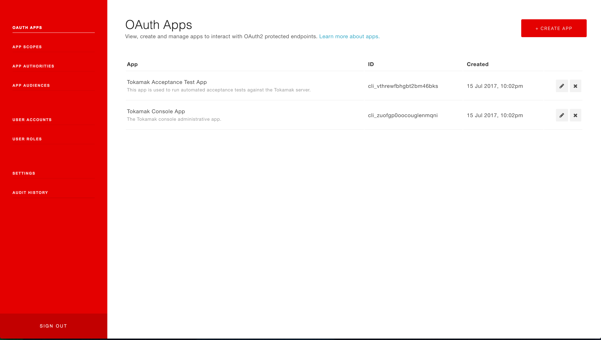

[](https://travis-ci.org/PatternFM/tokamak)
[](https://coveralls.io/github/PatternFM/tokamak?branch=master)  [](https://codebeat.co/projects/github-com-patternfm-tokamak-master)  

# Introduction

Tokamak is a Spring Boot OAuth2 JWT Authorization Server with a React administrative console to simplify the management your OAuth2 apps and accounts.



# Documentation

A quick start guide and reference documentation for Tokamak is hosted on the [Tokamak Project Page](http://pattern.fm/tokamak/#documentation).


# Building from Source

Both JDK 8 and Maven 3 are required to build Tokamak from source. With these prerequisites in place you can build Tokamak by:
```
git clone https://github.com/PatternFM/tokamak.git
cd tokamak
mvn clean install
```

# Continuous Integration

The Continuous Integration service for the project is hosted on [Travis](https://travis-ci.org/PatternFM/tokamak) 


# Licensing

This software is provided and distributed under the Apache Software License 2.0. Refer to LICENSE.txt for more information.